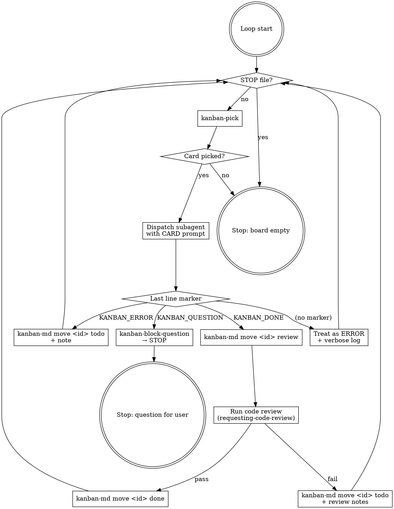

# superpowers-kanban-auto-mode

This skill governs how the orchestrator agent (the parent Claude session that ran `/kanban-auto`) drives the auto-loop. It complements the model defined in `superpowers:superpowers-kanban` — invoke that skill first if you haven't.

## The loop

For up to `auto_mode.max_iterations` iterations (default 20, from `.superpowers-kanban/config.json`):



## Pre-flight checks (before the first pick)

1. Read `.superpowers-kanban/config.json` → confirm `active_plan` is set. If null, refuse and tell the user to run `/kanban-add-plan <id> <plan.md>` first.
2. Verify the active board exists at `.superpowers-kanban/plans/<active_plan>/`.
3. Check for `.superpowers-kanban/STOP` — if present, refuse to start; tell the user to delete it first.
4. Check for `.superpowers-kanban/auto-lock` — if present and younger than 2× `claim_ttl_minutes`, refuse: another auto-loop is running. Otherwise treat as stale, delete it, proceed.
5. Create `.superpowers-kanban/auto-lock` containing the orchestrator PID/agent-name and a timestamp.
6. Set up a trap: on every exit path, delete `auto-lock`.

## Subagent prompt template

Each iteration dispatches a fresh subagent. Use the `Agent` tool with `subagent_type: "general-purpose"` (or a dedicated implementer agent if configured). Prompt:

````text
You are executing one card from a kanban board. Use the relevant
superpowers skills (subagent-driven-development, test-driven-development,
systematic-debugging, etc.) where they apply.

REPO: <project root>
ACTIVE BOARD: <active board dir>
CARD ID: <id>
CARD TITLE: <title>

CARD BODY:
---
<verbatim card body>
---

If this card has prior `## Answer` sections in its body from earlier
/kanban-resume calls, those are answers from the user that you MUST
respect — they are the most current source of truth for this task.

YOUR JOB:
1. Do the work the card describes.
2. Write tests where appropriate (TDD).
3. If anything is unclear or requires a human decision you cannot
   reasonably make, do NOT guess and do NOT just give up. Use the
   QUESTION protocol below.

WHEN YOU FINISH, your VERY LAST line of output MUST be exactly one of:

  KANBAN_DONE
  KANBAN_QUESTION: <one-line summary>
  KANBAN_ERROR: <one-line summary>

Rules:
- DONE: the task is implemented, tests pass, ready for review.
- QUESTION: you need a human answer. BEFORE emitting the marker, run:
    kanban-md --dir <active board dir> edit <id> --append-body "## Question\n\n<your full multi-line question here>"
  Then put the one-line summary on the marker line.
- ERROR: tool failure, plan inconsistency, or other blocker that isn't a
  human question.

You may use any tools available. Do NOT change the card's status
yourself — the orchestrator handles transitions based on your marker.
Do NOT release the claim — the orchestrator handles it.
````

## Parsing the marker

After the Agent call returns, read its result text. Take the **last non-empty line** and match:

- Exact `KANBAN_DONE` → success
- Prefix `KANBAN_QUESTION:` → block-question path
- Prefix `KANBAN_ERROR:` → error path
- Anything else → treat as ERROR with summary `"no marker found; subagent ended with: <last line>"`

## Action handlers

| Marker | Command |
|---|---|
| DONE | `kanban-md --dir <board> move <id> review` → run `superpowers:requesting-code-review` against the card's diff → on pass `kanban-md move <id> done`; on fail `kanban-md edit <id> --append-body "## Review feedback\n\n..." && kanban-md move <id> todo --claim <agent> --release` is wrong; use `kanban-md move <id> todo` |
| QUESTION | `bin/kanban-block-question <id> "<summary>"` → STOP the loop, tell the user the card id and summary |
| ERROR | `kanban-md --dir <board> edit <id> --release --append-body "## Error\n\n<summary>" && kanban-md move <id> todo` |

## Hard rules

- The orchestrator NEVER asks the user mid-loop. The only way to ask is the QUESTION protocol. If the orchestrator itself can't continue (e.g. pre-flight failed) → stop with a clear message.
- The orchestrator NEVER changes a card's status by editing files directly. Always go through `kanban-md`.
- The orchestrator NEVER skips the STOP-file check. Check it before every pick.
- The orchestrator NEVER raises `max_iterations` mid-loop. If it runs out, stop and tell the user.
- The orchestrator NEVER spawns more than one subagent at a time. The loop is strictly sequential.

## Resuming after a question

When the user runs `/kanban-resume <card-id> "<answer>"`:

1. `bin/kanban-resume` appends the answer to the card body and sends it back to `todo`.
2. The user then re-runs `/kanban-auto`. The next iteration's `pick` will surface the same card; the subagent will see the answer in the card body and continue.

The user can also resume multiple blocked cards before re-running auto.

## Stop conditions (in priority order)

1. STOP file present → stop, print "STOP file detected. Delete .superpowers-kanban/STOP to resume." and exit.
2. QUESTION marker → stop, print card id + summary + "Answer with /kanban-resume <id> '...'" and exit.
3. ERROR three times in a row for different cards → stop, print "Three consecutive errors; investigation needed." and exit. (Single errors don't stop the loop.)
4. `pick` returns no eligible card → stop, print "Board empty (or all blocked/claimed). Active plan complete?" and exit.
5. `max_iterations` reached → stop, print "Reached max_iterations=N. Re-run /kanban-auto to continue." and exit.

## Anti-patterns

- "I'll just answer the question myself and continue" — NO. The whole point of QUESTION is that the human must answer. Always stop.
- "I'll move the card back to todo and try again immediately" — NO. If a subagent failed, the orchestrator records the error and the next pick will surface the card (or another). Don't busy-loop on the same card.
- "The subagent forgot the marker, I'll guess what it meant" — NO. Treat as ERROR; the user can re-examine.
